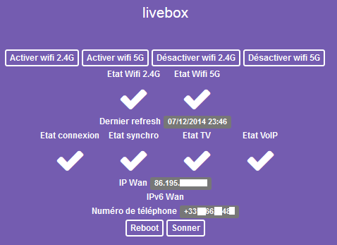
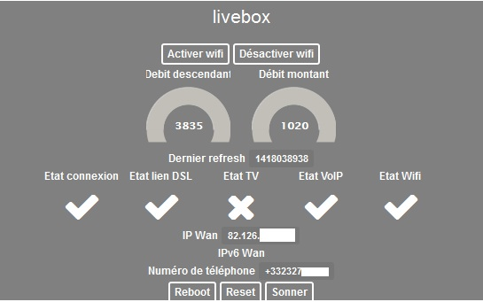

Présentation
===
Ce plugin permet de récupérer des informations de la Livebox et de lancer des actions.
Il a été développé à l'origine par Thomas Guenneguez.

La fonctionnalité de recherche du nom des appelants (***Utiliser Pages jaunes*** et ***Favoris***) est basée sur l'idée et le code de jpty qui en a aussi assuré le test.
Merci à lui pour toute l'aide apportée.

Compatibilité :
---

Le plugin a été testé avec les versions suivantes de la Livebox :
- Livebox 2
- Livebox Play
- Livebox 4 (depuis la version du 09/12/2019)
- Livebox 5 ou Livebox Fibre (depuis la version du 13/12/2019)

Informations visibles :
---

- **Etat connexion** : état de la connexion internet (xDSL ou Fibre)
- **Etat synchro** : état de la synchronisation xDSL ou FTTH
- **Etat TV** : état du service TV
- **Etat VoIP** : état du service téléphonie par internet
- **Débits descendant et montant** : débits de la liaison xDSL upload et download (pas compatible Fibre)
- **IP Wan** : adresse IP publique (IPv4)
- **IPv6 Wan** : adresse IP publique (IPv6)
- **Numéro de téléphone** : numéro de téléphone VoIP
- **Etat Wifi** : état du service Wifi. Pour Livebox 2 : uniquement Wifi 2.4Ghz. Pour les Livebox Play, 4 et 5: état du service Wifi pour les fréquences 2.4Ghz et 5Ghz
- **Etat Wifi invité** : état du service Wifi invité pour la Livebox 4
- **Nombre des appels entrants**
- **Nombre des appels sortants**
- **Nombre des appels manqués**
- **Nombre total des appels**
- **Liste des appels entrants**
- **Liste des appels sortants**
- **Liste des appels manqués**
- **Liste des appels**

Pour les 4 listes des appels un widget (deroulant avec Jeedom V4 et deroulantv3 avec Jeedom V3) est disponible qui permet d'avoir une liste déroulante avec un ascenseur 
pour limiter la place prise par la liste sur le dashboard. Avec Jeedom V3 ce widget est copié dans le plugin Widget lors de l'installation pour être plus facilement disponible.

Pour les widgets deroulant et deroulantv3 les paramètres optionnels suivants sont disponibles pour ajuster leurs dimensions (merci à Salvialf pour ce code)

**hauteurMax** : hauteur maximum en pixels. Valeur par défaut = 150

**largeur** : largeur en %. Valeur par défaut = 100

Dans la table **Liste des appels** un petit cœur (vert si vous avez activé les icônes colorées) permet d'ajouter un correspondant dans la liste des favoris s'il n'y est pas déjà
en indiquant au passage le nom sous lequel on souhaite voir listés ses appels. Attention cette fonctionnalité est dépendante du widget deroulant ou deroulantv3. 
Si vous avez choisi un autre widget elle ne sera pas disponible.

Actions possibles :
---

- **Activation/Désactivation du WiFi** : permet d'activer ou de désactiver le WiFi. Pour Livebox 2 : uniquement le Wifi 2.4Ghz. Pour Livebox Play, 4 et 5: activation/désactivation par fréquence WiFi (2.4Ghz et/ou 5Ghz).
- **Activation/Désactivation du WiFi invité** : Pour Livebox 4, permet d'activer ou de désactiver le WiFi invité (les fréquences activées sont les mêmes que pour le Wifi privé).
- **Reboot** : permet de redémarrer la Livebox
- **Sonner** : permet de faire sonner votre téléphone VoIP pendant 5 secondes (pour tester le fonctionnement entre la Livebox et votre téléphone)

Historiser activable pour :
---

- **Etat connexion** : état de la connexion internet (xDSL ou Fibre)
- **Etat synchro** : état de la synchronisation xDSL ou FTTH
- **Etat TV** : état du service TV
- **Etat VoIP** : état du service téléphonie par internet
- **Etat Wifi** : état du service Wifi. Pour Livebox 2 : uniquement Wifi 2.4Ghz. Pour Livebox Play, 4 et 5 : état du service Wifi pour les fréquences 2.4Ghz et 5Ghz

Installation/Configuration
===

Configuration du plugin
---

- **Utiliser Pages jaunes** : Si cette option est cochée le plugin ira chercher sur le site Pages Jaunes le nom de l'appelant, s'il est disponible
Ceci ne marche bien sûr que pour un appel en France et le site répond "Oups" si le nom n'est pas disponible, par exemple si ce correspondant est sur liste rouge.
Le nom n'est recherché qu'une fois sur Pages jaunes, il est mémorisé dans la base de données de Jeedom.

- **Durée min appel entrant (s)** : les appels entrants dont la durée en secondes est inférieure à cette valeur seront considérés comme manqués.
Cela permet par exemple de considérer l'apel comme manqué si le correspondant raccroche dès qu'il constate qu'il est en ligne avec un répondeur.

- **Regroupement par numéro de téléphone dans la liste des appels** Si cette option est cochée, les appels seront regroupés par numéro d'appel. Dans le cas de plusieurs
appels d'un même correspondant le nom et le numéro ne sont pas répétés dans la table.

- **Favoris** : Vous pouvez entrer dans ce tableau des noms et des numéros de téléphone associés. cela permet par exemple de personnaliser le nom d'un correspondant ("Frangin", "Jimmy", ...) 
ou d'indiquer un nom pour un correspondant étranger. Il y a un bouton pour ajouter une ligne ou supprimer un favori.
Si un numéro est dans les favoris, le nom associé a toujours priorité et Pages jaunes ne sera pas consulté pour ce numéro.
Il est possible d'utiliser les favoris même si **Utiliser Pages jaunes** n'est pas coché.

Attention ! N'oubliez pas de cliquer sur Sauvegarder pour que les favoris soient enregistrés.

Configuration de l'équipement Livebox
---

Nous allons maintenant paramétrer l'équipement. Pour ce faire, cliquer sur **Plugins / Communicaton / Livebox**

Puis définir :

- Objet parent
- Catégorie (optionnelle)
- Activer (coché par défaut)
- Visible (optionnel si vous ne désirez pas le rendre visible sur le Dashboard)
- Mot de passe de la Livebox (à modifier s'il ne s'agit pas de celui par défaut)

Et pour finir, cliquer sur Sauvegarder

Les paramètres accessibles sont les suivants :
- Etat
- Etat synchro
- Etat connexion
- Etat TV
- IP Wan
- IPv6 Wan
- Dernier refresh
- Etat Wifi ou Etat wifi 2.4G et Etat wifi 5G
- Liste des équipements

Les commandes sont les suivantes :
- Reboot
- Sonner
- WPS Push Button
- Activer wifi ou Activer wifi 2.4G et Activer wifi 5G
- Désactiver wifi ou Désactiver wifi 2.4G et Désactiver wifi 5G

Les paramètres suivants ne sont visibles que si le protocole VOIP était activé lors de la sauvegarde de l'équipement :
- Etat VoIP <protocole>
- Numéro de téléphone <protocole>
- nombre et tableau des appels entrants, sortants et manqués. Nombre total des appels.

Les paramètres suivants ne sont visibles qu'en connexion de type dsl ou vdsl :
- Débit montant
- Débit descendant
- Marge de bruit montant
- Marge de bruit descendant

Si le plugin Agenda est installé et activé un onglet **Programmation** permet de programmer les commandes action du plugin dans un agenda et fournit leur liste s'il y en a.

FAQ
===

*Pourquoi le plugin est gratuit ?*

Ce plugin est gratuit pour que chacun puisse en profiter simplement.

*J'aimerais remonter des erreurs/modifications directement dans le code ?*

C'est tout à fait possible via le forum communautaire Jeedom https://community.jeedom.com/ catégorie Plugins -> Communication. Créez un nouveau sujet et n'oubliez pas de lui ajouter le tag "plugin-livebox".

*Quelle est la fréquence de rafraîchissement des informations ?*

Le plugin actualise les informations toutes les minutes (modifiable dans le "Moteur de tâches")

*Est-il possible d'historiser les débits ?*

Pour historiser, il faut aller dans le menu Plugin => Communication => Livebox et activer l'historique sur les indicateurs comme pour n'importe quel indicateur.

*Avec quelles Livebox est-ce compatible ?*

- Livebox 2
- Livebox Play
- Livebox 4
- Livebox 5 (peu de tests, remontez sur le forum communautaire les problèmes rencontrés)

*Est-ce compatible avec la fibre ?*

Oui

*Je n'ai pas d'information sur le débit, est-ce normal ?*

L'API de la Livebox en mode FTTH ne fournit pas le débit. Nous ne pouvons donc pas le récupérer.

*Le mot de passe que je saisis ne fonctionne pas.*

Le plugin ne supporte pas certains caractères spéciaux genre # et @.

*Je change de Livebox, faut-il faire quelque chose ?*

Il est nécessaire de sauvegarder à nouveau l'équipement Livebox pour que le plugin gère bien la détection du modèle.

*Pourquoi ces "Oups" dans la liste des appels ?*

C'est ce que répond Pages jaunes s'il ne peut révéler le nom du correspondant (liste rouge, ligne interne à une entreprise, ...).
Si vous connaissez le nom du correspondant vous pouvez l'indiquer en favori pour éviter le Oups.

*Sur Jeedom Smart comment faire pour que les dates des appels soient en français*

Malheureusement le package locale français ne semble pas installé sur Smart. Passez la commande sudo dpkg-reconfigure locales pour installer le package fr_FR.UTF-8.
La commande locale -a permet de lister les locales disponibles.